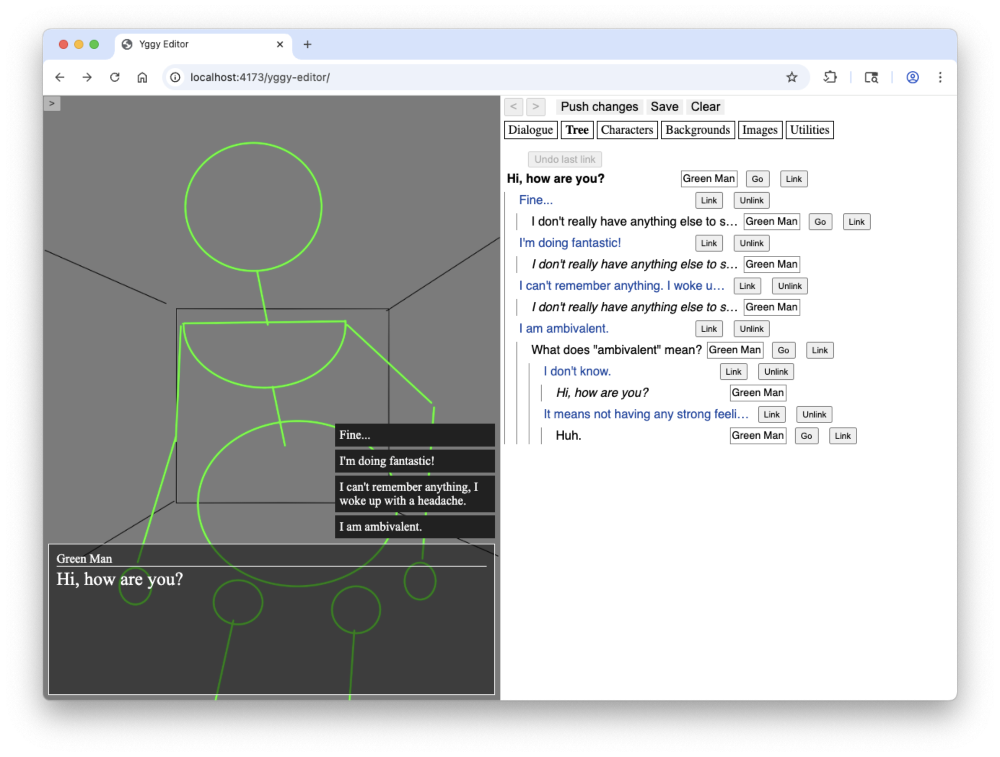

# yggy-editor

**yggdrasil editor** - web-based editor for dialogue tree games

> [!NOTE] See any potential here? Let me know / Spread the word!
>
> I've been restoring + refurbishing my projects but I need users and feedback. If you have any interest in using this project, please get in touch via the **Issues** tab or one of the links under **Sponsor this project** to the right. [My profile](https://github.com/parsehex) may have updated contact info.

## About

I made this little game engine + editor in 2019 for a friend to be able to more easily make games that primarily use a dialogue tree. As is common, technical debt set in and I lost steam on the project.

Now I'm working to get the editor running fully in the browser, ideally as a PWA that allows directly editing and building the game using the filesystem.

You can use the app at <https://parsehex.github.io/yggy-editor/> which will let you edit the dialogue tree and use the built-in example image assets.

----

Original readme follows:

## Setup

- Be sure to run `symlinks.sh` in the project root (`npm run init`)
  - Don't store anything in the non-root `assets` directories; they are deleted as part of `symlinks.sh`
- `npm run dev [script-name]` where `[script-name]` can be `game`, `editor`, or `editor-server`
- Add `sass` to your PATH. dart-sass is recommended.

## Update Script

The `update.sh` is a convenience script for updating the (editor) server. It clones the master branch, backs up data (to `~/title-22-backup`), does whatever init is necessary and restarts the server.

Since the update scrpt is part of the repo and the update script itself will be updated over time, it's recommended to manually overwrite the update script with the current version before running it (hint: `echo "" > update.sh`).

As of now it shouldn't be as necessary to do this since the installation steps are split from the update script, but it still might be a good idea to update. **TODO**
